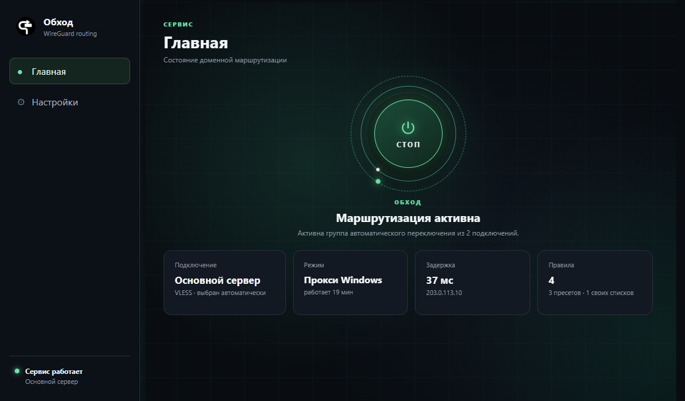
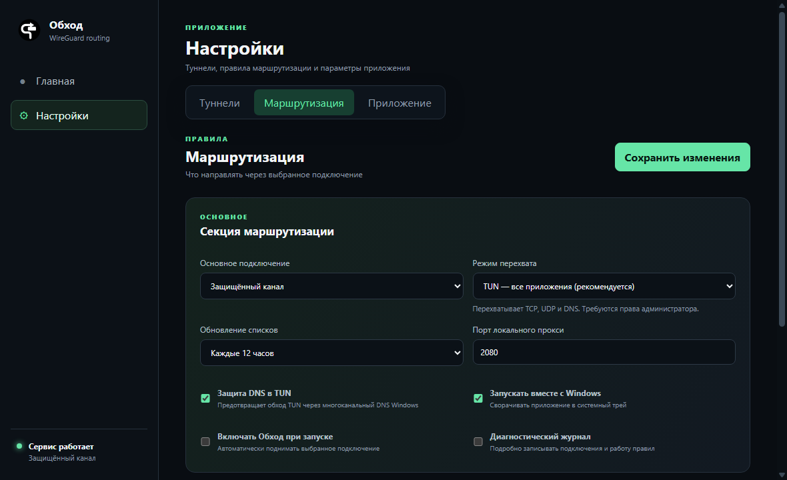
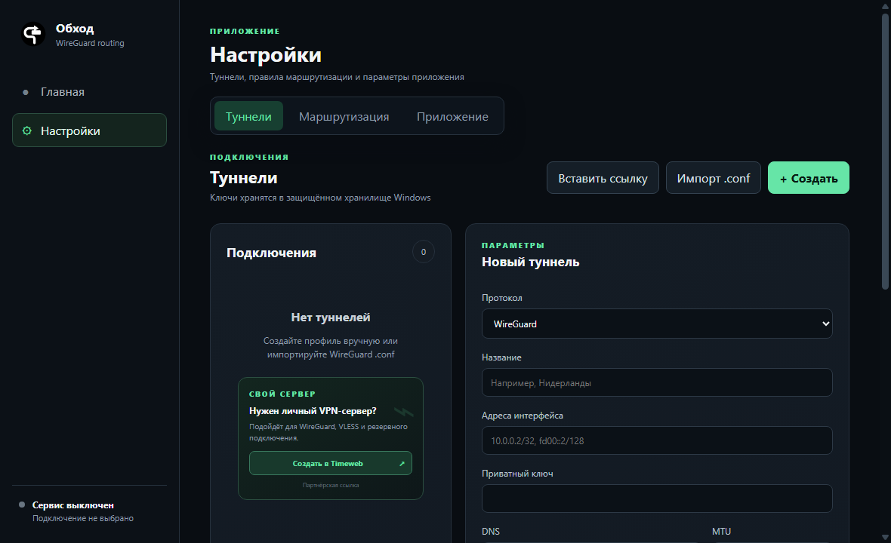

  

<h1 align="center">Обход</h1>

  Утилита для безопасности, выборочной маршрутизации и контроля сетевого трафика в Windows.

  <a href="https://github.com/Ktoto59/obhod-releases/releases/latest"><strong>Скачать последнюю версию</strong></a>

## О программе

«Обход» помогает управлять тем, через какое подключение направляется трафик выбранных доменов и подсетей. Правила применяются локально на компьютере: отмеченные ресурсы работают через защищённый туннель, а остальной трафик продолжает использовать обычное подключение.

Приложение подходит для разделения личного и рабочего трафика, защиты соединений в недоверенных сетях, централизованного управления сетевыми маршрутами и автоматического выбора доступного сервера. На главном экране отображаются активное подключение, выбранный сервер группы и прямой ping до него.

## Возможности

- выборочная маршрутизация доменов, IP-адресов и подсетей;
- режимы TUN, системного прокси Windows и локального прокси;
- профили WireGuard, VLESS/Reality, Shadowsocks и Trojan;
- импорт WireGuard `.conf` и ссылок подключения;
- готовые, локальные и внешние списки правил;
- автоматическое переключение на доступный сервер при сбое активного подключения;
- встроенный DNS-резолвер с UDP, TCP, DNS over TLS и DNS over HTTPS;
- готовые DNS-профили Cloudflare, Google, Quad9, AdGuard и Control D;
- проверка фактической задержки DNS-запроса;
- проверка конфигурации и доступности сервера перед сохранением;
- защита DNS в TUN-режиме;
- диагностический журнал с безопасным экспортом;
- работа в системном трее и автозапуск;
- ненавязчивые уведомления о новых версиях и ручное подтверждение загрузки обновления.

## Управление маршрутами

Основное подключение, режим перехвата и правила собраны в одном разделе. При включённом автоматическом переключении интерфейс показывает всю группу серверов вместо одного «основного» подключения. Дополнительные списки и параметры отказоустойчивости доступны в расширенных настройках.

## DNS и контроль запросов

Встроенный резолвер обрабатывает DNS-запросы доменов из выбранных правил и направляет их через активное подключение или группу. Можно выбрать обычный DNS, DoT или DoH, настроить bootstrap-сервер и TTL ответа. Готовые профили автоматически подставляют корректные адреса и DoH-пути.

Кнопка проверки отправляет настоящий DNS-запрос с текущего компьютера и показывает задержку и адрес ответившего сервера. Для защищённых протоколов дополнительно проверяются TLS и корректность ответа DoH.

## Подключения

Можно создать профиль вручную, импортировать WireGuard-конфигурацию или вставить ссылку поддерживаемого протокола. Чувствительные параметры профилей хранятся локально в защищённом хранилище Windows.

## Безопасность и приватность

- ключи и параметры подключений защищаются средствами Windows DPAPI;
- конфигурации и пользовательские списки остаются на компьютере;
- диагностический экспорт скрывает ключи, пароли, UUID и ссылки подключений;
- перед запуском конфигурация проверяется ядром `sing-box`;
- при завершении работы приложение восстанавливает настройки системного прокси.

## Системные требования

- Windows 10 или Windows 11, x64;
- права администратора для TUN-режима;
- подключение к сети для загрузки и обновления внешних списков.

## Установка и обновление

1. Откройте раздел [Releases](https://github.com/Ktoto59/obhod-releases/releases/latest).
2. Скачайте `Obhod-Setup-<версия>.exe`.
3. Запустите установщик и следуйте его инструкциям.

Приложение может автоматически искать новые версии после запуска и затем каждые шесть часов. Загрузка не начинается без подтверждения пользователя: уведомление появляется на главной странице, а скачать и установить обновление можно в разделе «О приложении». Уведомление разрешено скрыть для конкретной версии.

Туннели, ключи, DNS-параметры и пользовательские правила сохраняются при обновлении.

> Этот репозиторий используется для публикации официальных установщиков и файлов автоматического обновления «Обхода».
