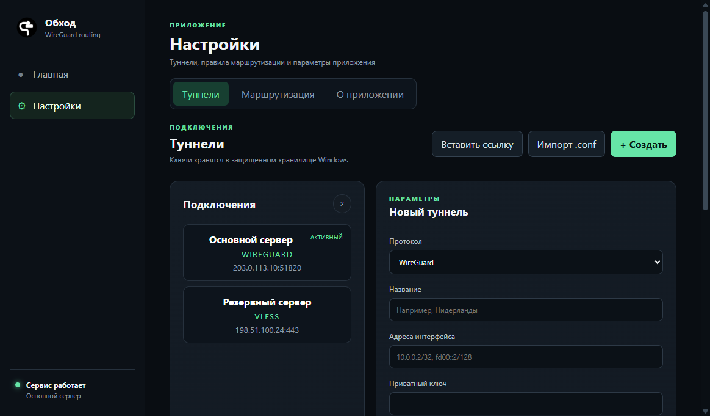
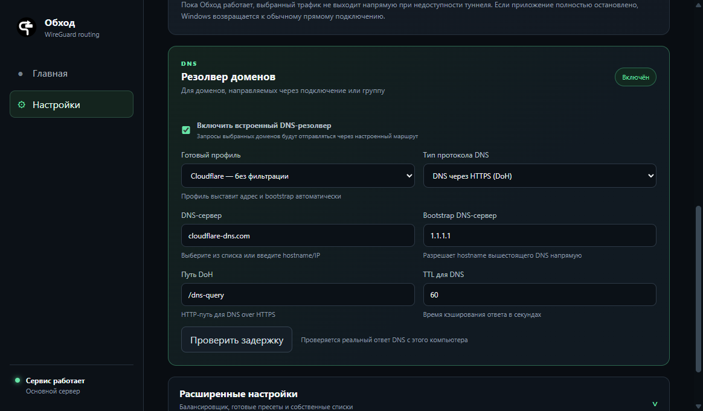
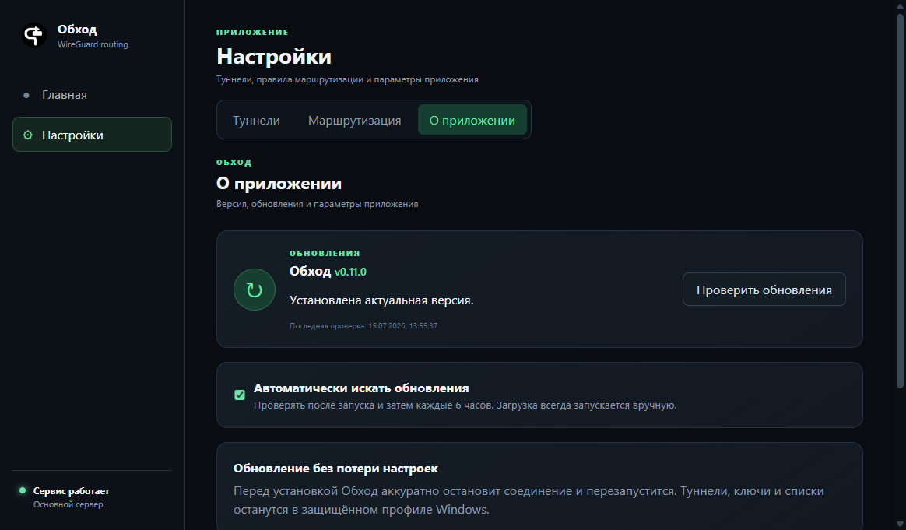

  

<h1 align="center">Обход</h1>

  Утилита для безопасности, выборочной маршрутизации и контроля сетевого трафика в Windows.

  <a href="https://github.com/Ktoto59/obhod-releases/releases/latest"><strong>Скачать последнюю версию</strong></a>

## Что делает приложение

«Обход» направляет трафик выбранных доменов и подсетей через заданное защищённое подключение. Остальной трафик продолжает использовать обычный маршрут Windows. Все правила, профили и пользовательские списки настраиваются локально.

Приложение показывает фактически работающий сервер, измеряет прямой ping до него и умеет автоматически переключаться на доступное резервное подключение.

## Основные возможности

- выборочная маршрутизация доменов, IP-адресов и подсетей;
- режимы TUN, системного прокси Windows и локального прокси;
- подключения WireGuard, VLESS/Reality, Shadowsocks и Trojan;
- импорт WireGuard `.conf` и ссылок подключения;
- готовые пресеты, собственные правила и внешние списки;
- группа автоматического выбора с переключением при сбое сервера;
- отображение активного сервера и прямого ping до него;
- встроенный DNS-резолвер с UDP, TCP, DoT и DoH;
- DNS-профили Cloudflare, Google, Quad9, AdGuard и Control D;
- проверка фактической задержки DNS-запроса;
- безопасный диагностический журнал и экспорт;
- системный трей, автозапуск и запуск соединения вместе с приложением;
- ручная загрузка обновлений и настраиваемая автоматическая проверка.

## Подключения

Профиль можно создать вручную, импортировать из WireGuard-конфигурации или добавить ссылкой. Несколько подключений разрешено объединить в группу автоматического выбора.

## Маршрутизация и отказоустойчивость

В разделе маршрутизации выбираются режим перехвата, локальный порт и правила запуска. Если включена группа автоматического выбора, интерфейс показывает все серверы группы вместо одного «основного» подключения.

При недоступности активного сервера `sing-box` продолжает проверки, выбирает доступный резервный маршрут и переводит на него существующие соединения. Пока сервис работает, выбранный трафик не выпускается напрямую при сбое туннеля.

## DNS-резолвер

Встроенный резолвер обрабатывает запросы доменов из выбранных правил через активное подключение или группу. Доступны обычный DNS по UDP/TCP, DNS over TLS и DNS over HTTPS.

Готовый профиль автоматически выставляет адрес сервера, bootstrap DNS и корректный DoH-путь. При необходимости можно указать собственный сервер и TTL. Кнопка проверки отправляет настоящий DNS-запрос и показывает задержку и IP ответившего сервера; для DoT и DoH также проверяется защищённое соединение.

## Обновления

Приложение умеет искать новую версию после запуска и затем каждые шесть часов. Автоматический поиск можно отключить.

Найденное обновление не скачивается без разрешения. На главной появляется компактное уведомление с номером версии, переходом в раздел «О приложении» и крестиком. Скрытие запоминается для конкретной версии. Загрузка и установка запускаются отдельными кнопками.

## Безопасность и приватность

- ключи и параметры подключений защищаются средствами Windows DPAPI;
- конфигурации и пользовательские списки остаются на компьютере;
- диагностический экспорт скрывает ключи, пароли, UUID и ссылки;
- перед запуском конфигурация проверяется комплектным ядром `sing-box`;
- при завершении работы восстанавливаются настройки системного прокси;
- обновления не загружаются и не устанавливаются без подтверждения.

## Системные требования

- Windows 10 или Windows 11, x64;
- права администратора для TUN-режима;
- подключение к сети для внешних списков, DNS-проверки и обновлений.

## Установка

1. Откройте [последний релиз](https://github.com/Ktoto59/obhod-releases/releases/latest).
2. Скачайте `Obhod-Setup-<версия>.exe`.
3. Запустите установщик и следуйте его инструкциям.

При обновлении сохраняются подключения, защищённые ключи, DNS-параметры и пользовательские правила.

> Этот репозиторий используется для публикации официальных установщиков и файлов обновления «Обхода».
