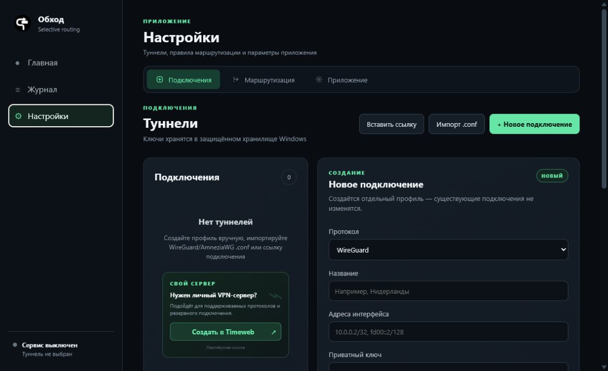

  

<h1 align="center">Обход</h1>

  Центр управления защищённой маршрутизацией в Windows

  <a href="https://github.com/Ktoto59/obhod-releases/releases/latest"><strong>Скачать последнюю версию</strong></a>
  ·
  <a href="https://github.com/Ktoto59/obhod">Исходный код и документация</a>

## Управляемый маршрут для нужного трафика

«Обход» направляет трафик выбранных программ, доменов и подсетей через
настроенные VPN- и прокси-подключения. Остальной трафик продолжает работать
напрямую.

Пользователь видит активный маршрут, контролирует применённые правила и может
объединить несколько подключений в группу автоматического выбора. Приложение
периодически проверяет маршруты реальным HTTPS-запросом и выбирает доступный
вариант без лишних переключений между близкими по скорости серверами.

## Возможности

- маршрутизация приложений, доменов, IP-адресов и подсетей;
- выбор установленных программ, запущенных процессов и отдельных `.exe`;
- режимы TUN, системного прокси Windows и локального прокси;
- WireGuard, AmneziaWG, VLESS/Reality, Shadowsocks, Trojan, Hysteria2, TUIC и
  AnyTLS;
- импорт WireGuard/AmneziaWG `.conf` и ссылок подключения;
- готовые пресеты, локальные правила и внешние `.srs`, `.json`, `.lst` и `.txt`;
- автоматический выбор рабочего маршрута с настраиваемой чувствительностью;
- реальные HTTPS-проверки соединения вместо ICMP;
- автоматическое восстановление после сна Windows, возврата сети или сбоя ядра;
- встроенный DNS-резолвер с UDP, TCP, DoT и DoH;
- системный трей, автозапуск и управляемая установка обновлений.

## Понятные настройки подключений

Создание нового профиля визуально отделено от редактирования существующего.
Параметры AmneziaWG сгруппированы по назначению, а технические поля системного
или локального прокси появляются только в соответствующем режиме.

## Автоматический выбор и устойчивость

Несколько подключений можно объединить в URLTest-группу. `sing-box` проверяет
их доступность через маршрут и выбирает рабочее подключение. Переключение на
более быстрый сервер происходит только при заметной разнице задержки, поэтому
стабильный маршрут не меняется из-за небольших колебаний.

При выходе Windows из сна, восстановлении сети или неожиданной остановке ядра
приложение выполняет ограниченное число попыток восстановления. Ручное
отключение всегда отменяет ожидающий перезапуск.

## Контроль данных

- профили и ключи защищаются средствами Windows DPAPI;
- конфигурации и пользовательские списки остаются на компьютере;
- скрытая телеметрия отсутствует;
- диагностический экспорт скрывает ключи, пароли, UUID, локальные пути и ссылки;
- перед запуском конфигурация проверяется комплектным ядром `sing-box`;
- при завершении работы восстанавливаются настройки системного прокси;
- обновления не скачиваются и не устанавливаются без подтверждения.

## Системные требования

- Windows 10 или Windows 11, x64;
- права администратора для TUN-режима;
- подключение к сети для внешних списков, проверки маршрутов и обновлений.

## Установка

1. Откройте [последний релиз](https://github.com/Ktoto59/obhod-releases/releases/latest).
2. Скачайте `Obhod-Setup-<версия>.exe`.
3. Запустите установщик и следуйте его инструкциям.

Подключения, защищённые ключи, DNS-параметры и пользовательские правила
сохраняются при обновлении.

> Этот репозиторий используется только для публикации официальных установщиков
> и файлов автоматического обновления «Обхода». Разработка ведётся в
> [`Ktoto59/obhod`](https://github.com/Ktoto59/obhod).
